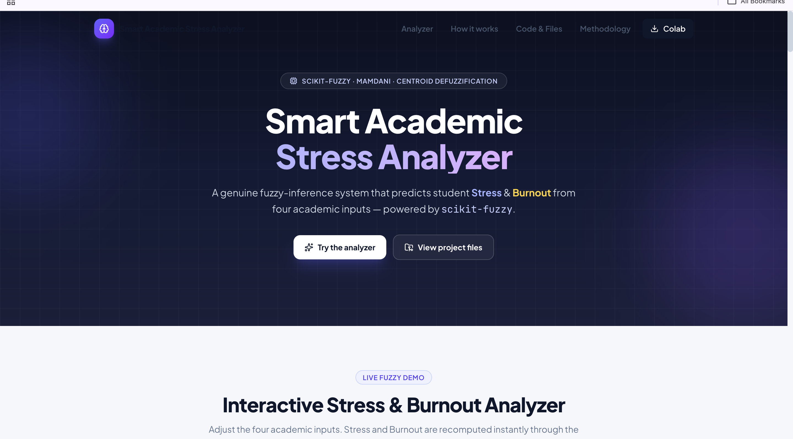
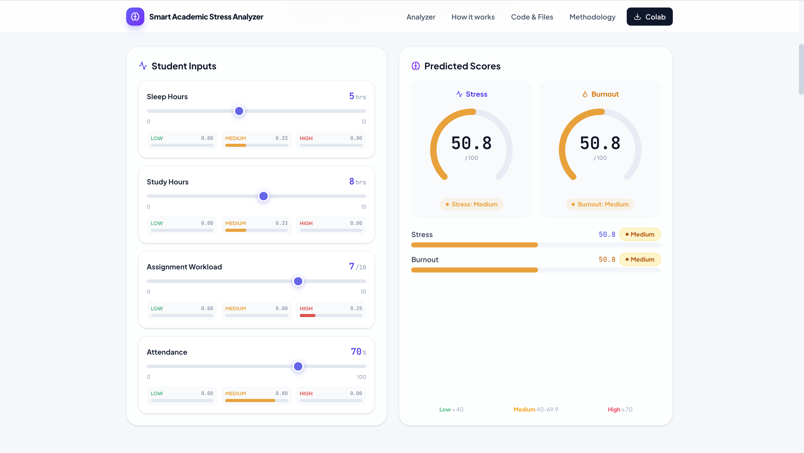
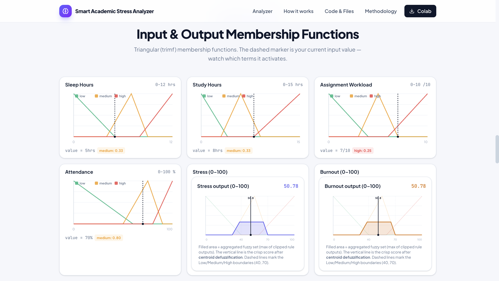

# Smart Academic Stress Analyzer

<p align="center">
  <strong>Academic Stress and Burnout Analysis using Mamdani Fuzzy Logic</strong>
</p>

<p align="center">
  A web-based academic stress analysis system that uses Soft Computing and Mamdani Fuzzy Logic to analyze student academic conditions and provide stress, burnout, and recommendation results.
</p>

<p align="center">
  <a href="https://academicstressanalyzer.vercel.app/">
    
  </a>
</p>

<p align="center">
  
  
  
  
  
  
</p>

---

## Live Demo

**Live Project:**
https://academicstressanalyzer.vercel.app/

The project is available as a live web application where users can interact with the academic stress analysis system.

---

# Overview

**Smart Academic Stress Analyzer** is a web-based application developed to analyze academic stress and burnout using **Mamdani Fuzzy Logic**.

The system takes student-related academic inputs and processes them through a fuzzy inference system. Based on the analysis, it provides:

* Stress Score
* Burnout Score
* Stress Level
* Burnout Risk
* Contributing Factors
* Personalized Recommendations
* Academic Action Plan

The project demonstrates the practical application of **Soft Computing and Fuzzy Logic** to an academic problem.

---

# Features

## Academic Stress Analysis

The system analyzes the student's academic information and generates a stress score.

The analysis is based on the inputs provided by the student and the fuzzy rules implemented in the system.

---

## Burnout Analysis

The application also calculates a burnout score and determines the corresponding burnout risk.

This allows the student to view both stress-related and burnout-related results.

---

## Mamdani Fuzzy Logic

The core analysis is implemented using a **Mamdani Fuzzy Inference System**.

The fuzzy system includes:

* Fuzzy sets
* Membership functions
* Fuzzification
* IF-THEN fuzzy rules
* Rule evaluation
* Aggregation
* Defuzzification

---

## Stress Level

The numerical stress result is converted into an understandable stress level so that the result is easier for the student to interpret.

---

## Burnout Risk

The burnout score is converted into an interpretable burnout-risk result.

---

## Personalized Recommendations

The application provides recommendations based on the student's analysis and contributing factors.

The recommendations are intended to help the student understand areas that may require attention.

---

## Academic Action Plan

The application provides an action-oriented plan based on the analysis results to help students take practical steps toward managing their academic situation.

---

## Responsive Web Interface

The project provides a responsive web interface that allows users to navigate through the existing sections of the application.

The interface includes navigation for the available project sections and analysis functionality.

---

## Methodology

The project includes a dedicated methodology section explaining the fuzzy-logic based approach used by the system.

The methodology covers the main stages of the fuzzy inference process.

---

## Code & Files

The project includes a **Code & Files** section where the existing project source files can be viewed.

The viewer provides access to files such as:

```text
fuzzy_system.py
app.py
recommendations.py
sample_demo.py
Smart_Academic_Stress_Analyzer.ipynb
requirements.txt
README.md
```

The Code & Files viewer is intended to display the actual existing project files rather than sample or replacement code.

---

# System Workflow

```text
Student
   ↓
Academic Input
   ↓
Input Processing
   ↓
Fuzzification
   ↓
Membership Functions
   ↓
Fuzzy Rule Evaluation
   ↓
Aggregation
   ↓
Defuzzification
   ↓
Stress & Burnout Analysis
   ↓
Contributing Factors
   ↓
Recommendations
   ↓
Final Result
```

---

# Fuzzy Logic Methodology

The main computational part of the project follows the standard Mamdani Fuzzy Inference process.

## 1. Input Variables

The student provides academic information through the application.

The inputs are then passed to the fuzzy analysis system.

---

## 2. Fuzzification

The numerical input values are converted into fuzzy linguistic values.

For example:

```text
Numerical Input
       ↓
Fuzzy Membership
       ↓
Low / Medium / High
```

Instead of using only strict boundaries, fuzzy logic allows an input to have a degree of membership in different fuzzy sets.

---

## 3. Membership Functions

Membership functions determine how strongly an input belongs to a particular fuzzy set.

For example:

```text
Input
  │
  │       Medium
  │      /------\
  │     /        \
  │____/          \____
  │
  └──────────────────────
```

The membership values are used by the fuzzy rules during inference.

---

## 4. Fuzzy IF-THEN Rules

The system uses fuzzy rules to represent relationships between academic conditions and stress/burnout.

Example:

```text
IF sleep is low
AND workload is high
THEN stress is high
```

The complete rule base is implemented within the project's fuzzy-system code.

---

## 5. Rule Evaluation

The fuzzy rules are evaluated according to the membership values of the input variables.

Multiple rules can contribute to the final output.

---

## 6. Aggregation

The outputs of the activated fuzzy rules are combined to form an overall fuzzy output.

---

## 7. Defuzzification

The aggregated fuzzy result is converted into a numerical value.

This produces the final stress and burnout scores used by the application.

---

# Inputs

The academic stress analysis uses student-related academic information such as:

| Input                 | Description                           |
| --------------------- | ------------------------------------- |
| Sleep Hours           | Student's average sleep duration      |
| Daily Study Hours     | Approximate daily study time          |
| Assignment Workload   | Level of academic assignment workload |
| Attendance Percentage | Student attendance percentage         |

These inputs are processed by the fuzzy inference system.

---

# Outputs

The application provides:

| Output          | Description                                 |
| --------------- | ------------------------------------------- |
| Stress Score    | Numerical representation of academic stress |
| Burnout Score   | Numerical representation of burnout         |
| Stress Level    | Interpretable stress category               |
| Burnout Risk    | Interpretable burnout-risk category         |
| Recommendations | Suggestions based on the analysis           |
| Action Plan     | Practical steps based on the analysis       |

---

# Soft Computing Concepts

This project demonstrates the practical implementation of **Soft Computing**, especially Fuzzy Logic.

The major concepts demonstrated are:

* Fuzzy Sets
* Membership Functions
* Fuzzification
* Fuzzy Inference
* IF-THEN Rules
* Rule Evaluation
* Aggregation
* Defuzzification

These concepts allow the system to handle academic conditions that are not always strictly binary.

---

# Why Fuzzy Logic?

Academic stress cannot always be represented accurately using simple fixed thresholds.

For example, instead of defining a condition only as:

```text
Study Hours > X → High
Study Hours ≤ X → Low
```

fuzzy logic can represent gradual changes:

```text
Low
  ↓
Moderate
  ↓
High
```

An input can therefore have different degrees of membership in different fuzzy sets.

This makes fuzzy logic useful for representing uncertain and gradual academic conditions.

---

# Technology Stack

## Frontend

* React
* TypeScript
* HTML
* CSS

## Runtime and Package Management

* Node.js
* npm

## Fuzzy Logic / Analysis

* Python
* Scikit-Fuzzy

## Development

* Git
* GitHub

## Deployment

* Vercel

---

# Project Structure

```text
Academic_Stress_Analyzer/
│
├── fuzzy_system.py
│   └── Mamdani Fuzzy Logic engine
│
├── app.py
│   └── Application logic/interface
│
├── recommendations.py
│   └── Contributing-factor analysis,
│       recommendations and action plan
│
├── sample_demo.py
│   └── Sample demonstration
│
├── Smart_Academic_Stress_Analyzer.ipynb
│   └── Jupyter Notebook
│
├── requirements.txt
│   └── Python dependencies
│
├── README.md
│   └── Project documentation
│
└── frontend/
    └── React/TypeScript web interface
```

---

# Running the Project Locally

## Prerequisites

Install:

* Node.js
* npm
* Python 3.x
* Git

---

## Install Frontend Dependencies

From the frontend/project directory:

```bash
npm install
```

---

## Start the Development Server

Run:

```bash
npm run dev
```

The terminal will display the local development URL.

Open the provided URL in your browser to run the application locally.

---

# Testing

The project includes testing to help verify existing functionality and prevent regressions during development.

Run the test suite using:

```bash
node --experimental-strip-types --test
```

Testing includes areas such as:

* Input validation
* Routine-related functionality where applicable
* Scheduling-related functionality where applicable
* V1 regression testing

---

# Build

To verify that the frontend can be built successfully:

```bash
npm run build
```

A successful build confirms that the application compiles without build errors.

---

# Development Workflow

```text
Make Changes
     ↓
Run Tests
     ↓
Run npm run build
     ↓
Check Application
     ↓
Review Changes
     ↓
Commit
     ↓
Push to GitHub
```

Example:

```bash
git status
git add .
git commit -m "feat: update academic stress analyzer"
git push
```

---

# Version History

## V1.0.0

The initial version focused on academic stress and burnout analysis using Mamdani Fuzzy Logic.

### V1 included:

* Academic stress analysis
* Burnout analysis
* Sleep hours
* Daily study hours
* Assignment workload
* Attendance percentage
* Membership functions
* Fuzzification
* Fuzzy rules
* Aggregation
* Defuzzification
* Stress score
* Burnout score
* Stress level
* Burnout risk
* Recommendations

---

## V2

The current version improves the application's web interface while maintaining the original fuzzy-logic based analysis.

Current improvements include:

* Updated web interface
* Responsive navigation
* Improved page navigation
* Methodology section
* Code & Files viewer
* Existing source-file viewing
* Improved presentation of the analysis
* Testing and regression checks

The original fuzzy-logic analysis remains the core of the project.

---

# Project Objectives

The main objectives of the project are:

1. To analyze academic stress using Mamdani Fuzzy Logic.
2. To estimate burnout risk based on academic inputs.
3. To demonstrate Soft Computing concepts through a practical application.
4. To identify factors contributing to academic stress.
5. To provide simple recommendations based on the analysis.
6. To create an accessible web-based academic stress analysis system.

---

# Academic Relevance

The project demonstrates the practical use of:

* Soft Computing
* Fuzzy Logic
* Artificial Intelligence
* Decision Support Systems
* Data Analysis
* Web Application Development

The project is particularly relevant to **Soft Computing** because the main analysis is based on a Mamdani Fuzzy Inference System.

---

# Limitations

The system is designed for **academic and educational purposes**.

The generated results depend on:

* User-provided information
* Membership functions
* Fuzzy rules
* Fuzzy inference implementation

The results should therefore be considered general academic insights and should not be treated as medical or psychological diagnosis.

---

# Future Scope

Possible future improvements include:

* Additional academic input parameters
* More detailed analysis
* Historical stress tracking
* Improved visualizations
* Student profiles
* Mobile application
* Notifications and reminders
* Expanded recommendation logic
* Database integration
* Additional fuzzy rules and membership functions


---

# Screenshots

Screenshots of the live application can be added here.

Example:

```markdown
## Home Page



## Stress Analysis



## Results


```
---

# Live Project

<p align="center">

<a href="https://academicstressanalyzer.vercel.app/">
  
</a>

</p>

---
<p align="center">
  <strong>Developed by Minal Maurya & Prachi Tripathi</strong>
  <br>
  <sub>Academic Project | Soft Computing | Mamdani Fuzzy Logic</sub>
</p>


# Disclaimer

This project is developed for **academic and educational purposes**.

The stress and burnout results are generated using the implemented fuzzy-logic system and the information provided by the user. They should not be considered medical or psychological diagnoses or a replacement for professional advice.
